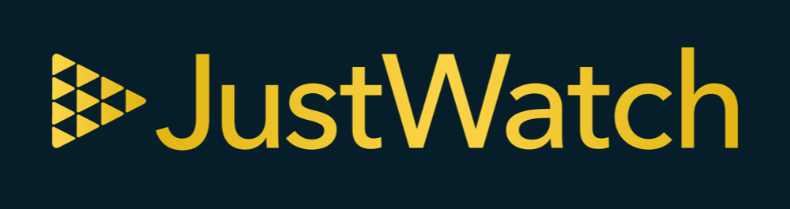

# Facebook Marketing API SDK for Golang

<!-- [](https://goreportcard.com/report/https://pkg.go.dev/https://github.com/justwatch/facebook-marketing-api-golang-sdk) -->

[](https://goreportcard.com/report/github.com/justwatch/facebook-marketing-api-golang-sdk)
[](http://godoc.org/github.com/justwatch/facebook-marketing-api-golang-sdk)

This go package provides a comprehensive list of methods for interacting with Facebook's Graph Marketing api.

---



## You enjoy working with the Facebook Marketing API? We are hiring! 

Find out what open positions we have at the moment and why JustWatch is a great place to work at: https://www.justwatch.com/us/talent

---

The SDK supports crud operations for the following entities:

- ad_account
- adset
- custom_conversion
- insights
- post
- videos
- adcreative
- audience
- event
- interest
- search
- ads
- campaign
- image
- page
- service

## Usage

We assume you already have a Facebook Developer account and configured an `accessToken` and `appSecret`. If not, checkout Facebooks [Get Started](https://developers.facebook.com/docs/marketing-apis/get-started)

### Create a new fbService client

```go
import(
	"github.com/justwatch/facebook-marketing-api-golang-sdk/marketing/v16"
)

func main(){
	fbService, _ := v16.New(l, accessToken, appSecret)
	
	// [Code snippets from other example below go here]
}
```

### Create a campaign

```go
c := v16.Campaign{
	// Populate struct values
}
id, _ := fbService.Campaigns.Create(ctx, c)
```

### Upload an external asset to Facebook

```go
accountID := "[account id]"
imagePath := "[path to image]"
imageName := "[image name]"

file, _ := os.Open(imagePath)
im, _ := fbService.Images.Upload(context.Background(), accountID,imageName, file)

// You now can access the ID of the uploaded image via im.ID
fmt.Println("Uploaded image has id: ", im.ID)
```

```go
accountID := "[account id]"
videoPath := "[path to video]"
videoName := "[video name]"

file, _ := os.Open(videoPath)
vid, _ := fbService.Videos.Upload(context.Background(), accountID, videoName, file)

// You now can access the ID of the uploaded video via vid.ID
fmt.Println("Uploaded video has id: ", vid.ID)
```

### Read campaigns from an account

```go
id := "[account_id]"

campaigns, _ := p.fbService.Campaigns.List(id).Do(ctx)
```

### Get reporting data for an account at adset level

```go
// put the columns you need for the report
columns := []string {}

//account id you want the report from
id := "[account_id]"


// Create new report
report := fbService.Insights.NewReport(id)

// Configure report
report.Level("adset").
	DailyTimeIncrement(true). // get day by day reporting
		Fields(columns...). // the fields you want your report to have
			DatePreset("lifetime") // the time period for the report

// pass a channel which gets populated with results
ch := make(chan v16.Insight)
nRecords,_ := report.GenerateReport(ctx,ch)

//range over the channel to get Insight objects
for insight := range ch {
    fmt.Println("New report result: ", insight)
}
```
